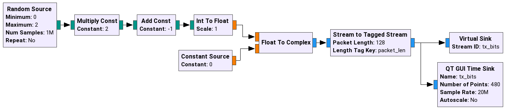
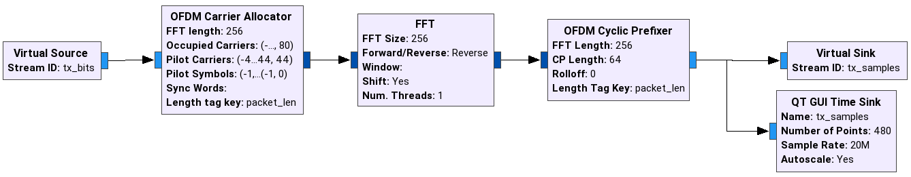
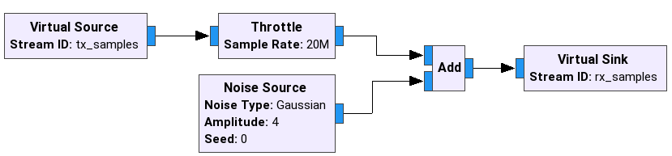
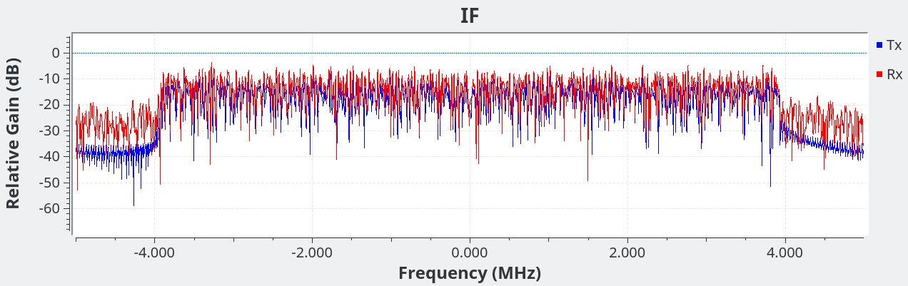
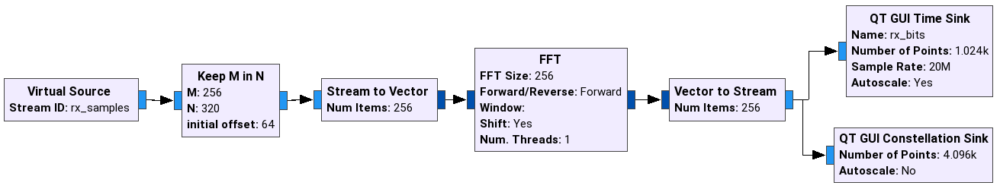
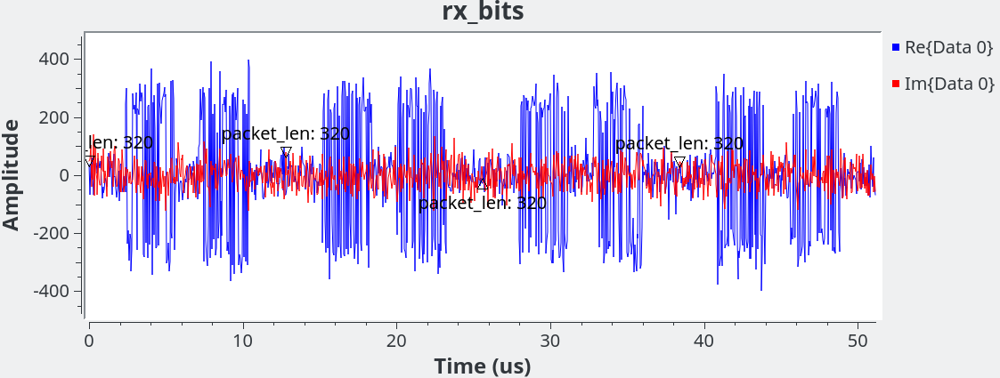
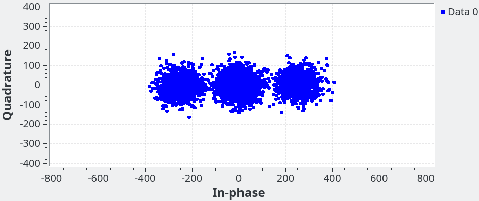

# OFDM pipeline

# Protocol

Keep it simple, stupid OFDM pipeline.

## Signal structure
 * encode data bits
 * add preamble symbols
 * add 32 pilots
 * zeros in DC area [-7..7]
 * zeros left/right ends of spectrum [-128..-97, 97...127]
 * 128 data subcarriers per symbol
 * BPSK modulation
 * IFFT 256
 * 1/4 Guard Inteval

[kiss-ofdm.grc](kiss-ofdm.grc)

## Transmitter

### Tx bit-stream

Generating randomized bit-stream, modulating with BPSK, tagging each 128 bit.

### Tx OFDM modulator

Allocating each of 128-bit to one of 256 subcarriers, FFT, CP

## Channel

Very simple AWGN channel.

## Receiver

### Rx OFDM demodulator

